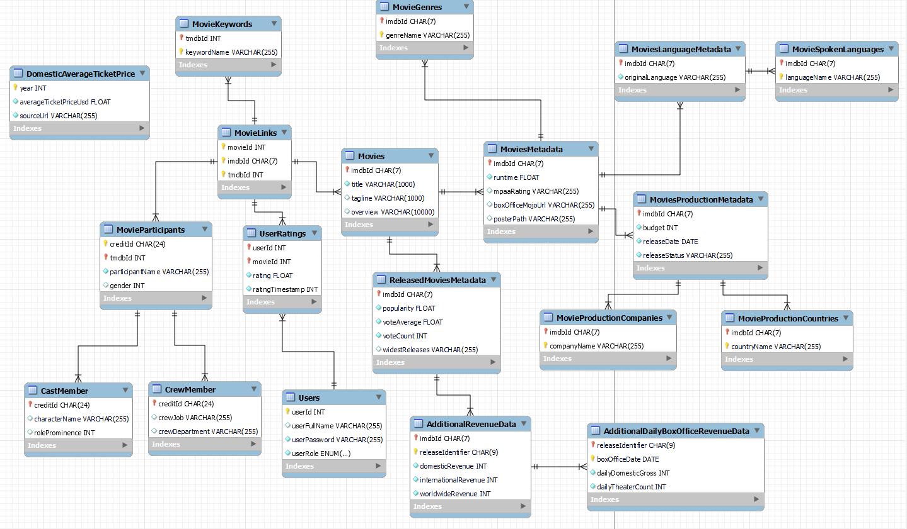

# CineBase

CineBase is a comprehensive movie database application that allows users to search, manage, and analyze movie data. The system provides detailed information about movies, their cast and crew, production details, revenue data, and user ratings.

## Folder Structure

```
.
├── Code
│   ├── ...
│   ├── Client       # containing client code
|   |   |-- client.py
|   |   |-- client_helpers.py
│   ├── SQL          # containing SQL code and python scripts for data processing
|   |   |-- sql_script_one.sql
|   |   |-- temp_data_processing_script_two.py
|   |   |-- temp_data_processing_script_three.py
|   |   |-- sql_script_four.sql
│   └── DataMining   # containing data mining code
|   |   |-- data_analysis.py
|   |   |-- feature_importance_analysis.py
├── Schema-Design
|   |-- entity_relationship_model_diagram.pdf
│   └── relational_schema_diagram.png
└── README.md
```

## Database Design

### Entity Relationship Model

The database design follows a well-structured entity-relationship model that captures the complex relationships between movies, people (cast and crew), production companies, countries, and user ratings. The ER model illustrates these relationships:

- **Movies** are the central entity, with relationships to multiple other entities
- **People** participate in movies as either cast or crew members
- **User Ratings** are associated with both users and movies
- **Production details** capture information about companies and countries involved in movie production
- **Performance data** tracks revenue and other financial metrics


### Relational Schema

The relational schema implements the ER model as a set of interconnected tables with appropriate primary and foreign keys. The schema ensures data integrity while allowing for efficient querying of complex movie information.



## Data Sources

CineBase uses movie data from the following Kaggle datasets:

- [The Movies Dataset](https://www.kaggle.com/datasets/rounakbanik/the-movies-dataset) - Primary dataset with comprehensive movie information including metadata, keywords, cast and crew details
- [Hollywood Stock Exchange Box Office Data](https://www.kaggle.com/datasets/zeegerman/hollywood-stock-exchange-box-office-data) - Financial performance data for movies
- [BoxOfficeMojo Movies with Budget Listed](https://www.kaggle.com/datasets/igorkirko/wwwboxofficemojocom-movies-with-budget-listed) - Additional budget and revenue information

To set up the database:

1. Download the datasets from the links above
2. Place the dataset CSV files in the `Code/SQL/data` directory (create this directory if it doesn't exist)
3. Follow the instructions in the "Instructions for Running SQL Code for Populating the Database" section below to import the data

## Client Application

The client application provides a user-friendly interface to interact with the movie database. It supports two user roles:

### Regular User Features

- Search for movies using various criteria (title, keyword, genre, cast, crew, rating, language)
- View detailed movie information, including performance metrics, cast and crew, production details
- Browse average movie ticket prices by year
- Add, update, and delete personal movie ratings

### Administrator Features

All regular user features plus:

- Add new movies to the database with complete metadata
- Update existing movie information, including associated entities
- Delete movies from the database

The application ensures data integrity through proper authentication and authorization checks.

## Instructions

### Instructions for Running Client Code

The client can be run using the command `python3 client.py` in the `Code/Client` directory.
At this point, the client code will provide clear instructions as to how to use the client app and will guide the user to enter the appropriate commands.

The command `pip install mysql-connector-python` will need to be run to ensure that the necessary packages are present for the client to work.

### Instructions for Running DataMining Code

The data mining analysis can be run using the command `python3.9 data_analysis.py` from within the `Code/DataMining` directory. This will generate a summary of the data mining analysis results for which attributes affect the revenue of a movie the most in the terminal. It will also generate two relevant plots as part of the data mining analysis.

The commands `pip install pandas`, `pip install matplotlib`, `pip install seaborn` and `pip install scikit-learn` will need to be run to ensure that the necessary packages are present for the data mining Python scripts to work.

### Instructions for Running SQL Code for Populating the Database

Four scripts including two SQL scripts and two Python scripts are required to be run in the order that they are numbered to populate the database with data. I go into detail on how this can be done below.

The command `pip install mysql-connector-python` will need to be run to ensure that the necessary packages are present for the Python scripts to work.

The first SQL script `sql_script_one.sql` can be run by first connecting to the database `cinebase_db` and then running the command `source sql_script_one.sql`. This SQL script will create all of the necessary tables and populate them with data along with some temporary tables that will be loaded with raw data to be processed and added to the appropriate tables that follow with the Python scripts.

The next script to run is a Python script `temp_data_processing_script_two.py` which takes care of processing TempDomesticAverageTicketPrice data, TempKeywords data, TempSpokenLanguages data, TempProductionCompanies data and TempProductionCountries data. This script will process the unformatted broken JSON data currently stored in these tables into usable data and then add it to the corresponding tables in the appropriate format by extracting the relevant data. This python script can be run using the command `python3 temp_data_processing_script_two.py` from within the `Code/SQL` directory.

The next script to run is a Python script `temp_data_processing_script_three.py` which takes care of processing TempMovieParticipants data, TempMovieCastMember data and TempMovieCrewMember data. This script will process the unformatted broken JSON data currently stored in these tables into usable data and then add it to the corresponding tables in the appropriate format by extracting the relevant data. This python script can be run using the command `python3 temp_data_processing_script_three.py` from within the `Code/SQL` directory.

The final script to run is a SQL script `sql_script_four.sql` which can be run by first connecting to the database `cinebase_db` and then running the command `source sql_script_four.sql`. This SQL script will finish off the database loading by cleaning up data added by the Python scripts and adding appropriate foreign keys to the tables which were affected by the Python scripts.
